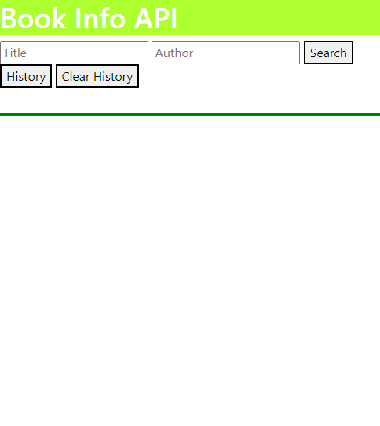
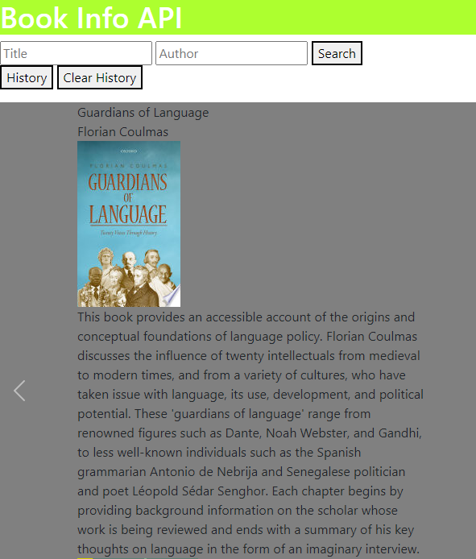

# Book Info API

A project made for users to input their book and author of choice which then outputs a brief synopsis of what the book is about along with pictures of its cover.

## Deployed page 

https://khoubaib-m.github.io/book-api/

## User Story

As a bookworm, I want to simply find key information about any book so that I may have an idea of what it is about and what it look like resulting in having an easy time choosing which books I want to read.

## Technologies used

Bootstrap, Jquery, Server API

## Usage

The webpage allows the user to search the name of the book and author. After clicking search the webpage will display a quick description of what the book is about along with a picture of the cover. 

In the image below is the description shown of the book

## Acceptance Criteria

Application uses at least two server-side APIs.

Application uses client-side storage to store persistent data.

Application doesn't use JS alerts, prompts, or confirms (uses modals instead).

Application uses Boostrap.

Application is interactive.

# Credits

## Collaborators

Maciej: https://github.com/MrMaciejM
Seh Cheong: https://github.com/sehcheong-ng
Khoubaib: https://github.com/khoubaib-m
Nanda: https://github.com/Nandanippani

## APIs used

Giphy: https://api.giphy.com/v1/gifs/random?tag=${etag}.data&api_key=apiKey 
Google API: https://www.googleapis.com/books/v1/volumes?&orderBy=newest&key=
